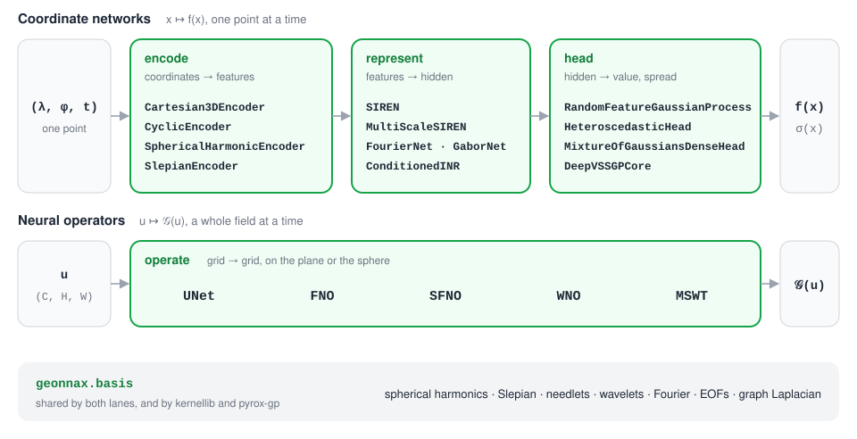
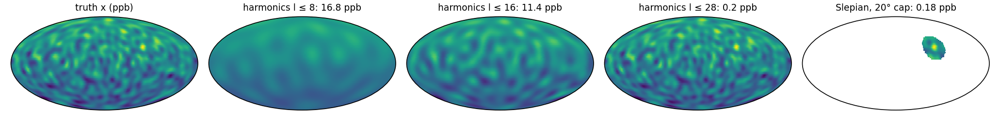
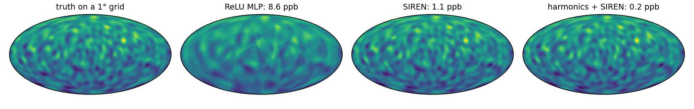
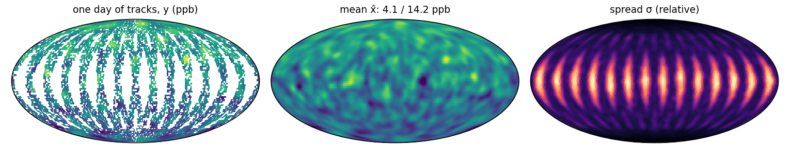
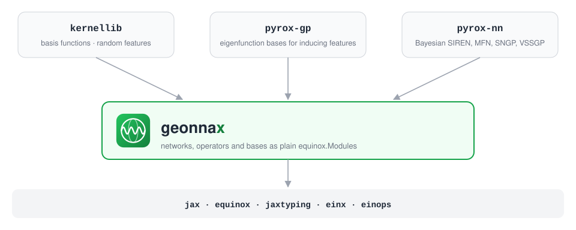
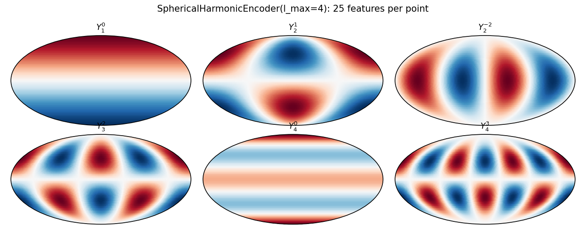
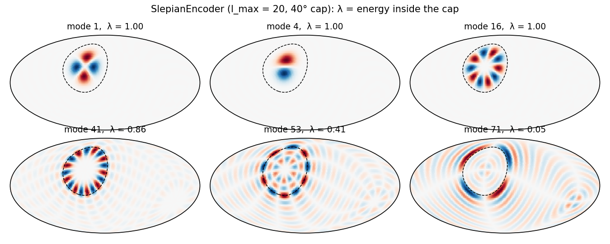
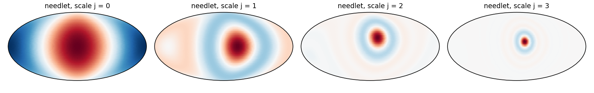

<p align="center">
  <picture>
    <source media="(prefers-color-scheme: dark)" srcset="docs/assets/logo-dark.svg">
    
  </picture>
</p>

<p align="center">
  <a href="https://github.com/jejjohnson/geonnax/actions/workflows/ci.yml"></a>
  <a href="https://github.com/jejjohnson/geonnax/actions/workflows/lint.yml"></a>
  <a href="https://github.com/jejjohnson/geonnax/actions/workflows/typecheck.yml"></a>
  <a href="https://codecov.io/gh/jejjohnson/geonnax"></a>
  
  <a href="https://opensource.org/licenses/MIT"></a>
</p>

<p align="center">
  <a href="https://jejjohnson.github.io/geonnax/"><b>Docs</b></a> ·
  <a href="https://jejjohnson.github.io/geonnax/api/"><b>API</b></a> ·
  <a href="#example-map-methane-around-the-globe"><b>Example</b></a> ·
  <a href="#gallery"><b>Gallery</b></a>
</p>

**Networks, neural operators and basis functions for fields on the plane and the sphere, in pure Equinox.**

geonnax has two families of models.
Coordinate networks take one point, a longitude and latitude (and a time, if you have one), and return the field's value there: an encoder turns the point into features, a representation network such as a SIREN maps those to a value, and an optional head adds a per-point spread.
Neural operators (U-Net, FNO, spherical FNO, wavelet operators) take a whole gridded field and return another.
Both draw on one library of bases: spherical harmonics, Slepian functions, needlets, wavelets, Fourier modes, EOFs and graph-Laplacian eigenvectors.

Every model is a plain `equinox.Module` with an `init(..., *, key)` constructor, acting on one example, so `jit`, `vmap` and `grad` work as usual.
Nothing in it is probabilistic: [pyrox](https://github.com/jejjohnson/pyrox) wraps these cores and swaps their parameters for NumPyro sites.

<p align="center">
  <picture>
    <source media="(prefers-color-scheme: dark)" srcset="docs/assets/hero-dark.svg">
    
  </picture>
</p>

## Installation

geonnax is not on PyPI yet; install it from GitHub with [uv](https://docs.astral.sh/uv/):

```bash
uv add "geonnax @ git+https://github.com/jejjohnson/geonnax.git"
```

It depends on jax, equinox, jaxtyping, einx and einops, and on nothing else.
Training loops are yours to write; the example below uses [optax](https://github.com/google-deepmind/optax) (`uv add optax`).

## Quick start

Three ways in: a coordinate network, a neural operator, and basis functions used as features in a model of your own.

```python
import equinox as eqx
import geonnax as gnx
import jax
import jax.numpy as jnp
import jax.random as jr
from jaxtyping import Array, Float


# Shapes: N points, M = (l_max + 1)² harmonics, K Slepian modes, C channels, P × Q grid
lo, hi = jnp.array([-jnp.pi, -jnp.pi / 2]), jnp.array([jnp.pi, jnp.pi / 2])
lonlat: Float[Array, "N 2"] = jr.uniform(jr.key(0), (1_000, 2), minval=lo, maxval=hi)  # rad

# A · Coordinate network: one point in, one value out; vmap over the points
# zₘ(λ, φ) = Yₗᵐ(λ, φ),  l ≤ 10
enc = gnx.SphericalHarmonicEncoder(l_max=10, input_mode="lonlat")  # (2,) → (M,)  encoders
# f(z) = W₄ sin(ω W₃ sin(ω W₂ sin(ω₀ W₁ z + b₁) + b₂) + b₃) + b₄
net = gnx.SIREN.init(121, 128, 1, depth=3, key=jr.key(1))           # (M,) → (1,)  siren
model = eqx.nn.Sequential([eqx.nn.Lambda(enc), eqx.nn.Lambda(net)])
f: Float[Array, "N 1"] = jax.vmap(model)(lonlat)                    # (N, 2) → (N, 1)

# B · Neural operator: a whole field in, a field out
# v = 𝒢(u),  each block a convolution in the spherical-harmonic domain
op = gnx.SFNO.init(3, 1, key=jr.key(2), n_lat=32, n_lon=64, l_max=15)  # sfno
u: Float[Array, "C P Q"] = jnp.ones((3, 32, 64))                    # (C, P, Q)
v: Float[Array, "1 P Q"] = op(u)                                    # (C, P, Q) → (1, P, Q)

# C · Basis functions: features for any model (least squares, a GP, your own network)
# gₖ = argmax_g ∫_R g² / ∫_S² g²,  band-limited to l ≤ 20,  R a 40° cap at the pole
cap = gnx.basis.slepian_cap_basis(20, 0.7, n_modes=40)              # basis
phi: Float[Array, "N K"] = jax.vmap(gnx.SlepianEncoder(cap))(lonlat)  # (N, 2) → (N, K)  slepian
```

`f`, `v` and `phi` come out with shapes (1000, 1), (1, 32, 64) and (1000, 40).
`eqx.nn.Lambda` wraps the two modules because `eqx.nn.Sequential` passes a `key` to each layer; a two-field `eqx.Module`, as in the example below, does the same job.

## Example: map methane around the globe

The GeoML stack's running example is one methane overpass: [kernellib](https://github.com/jejjohnson/kernellib#example-map-methane-from-one-overpass) and [pyrox](https://github.com/jejjohnson/pyrox#example-map-methane-from-one-overpass) map XCH₄ over a 100 × 100 grid in the Permian Basin.
geonnax's encoders and operators earn their keep on the sphere, so here the same quantity is mapped over the whole globe from one day of satellite tracks.

The state x is column-averaged methane, XCH₄, in ppb on a 2° grid, so N = 16,200 cells.
A sun-synchronous satellite crosses the globe on 14 tracks a day, each 8° wide, and clouds hide 30 % of what it passes over; that leaves O = 7,921 observed cells, each with noise of σ_obs = 6 ppb.
The block below simulates the day: a background with a north–south gradient, six regional sources and synoptic variability up to degree 28.
A real L2 product's pixels drop in for `lonlat`, `mask` and `y`.

```python
import einx
import equinox as eqx
import geonnax as gnx
import jax
import jax.numpy as jnp
import jax.random as jr
import optax
from jaxtyping import Array, Bool, Float


# Shapes: N = 90 × 180 cells of a 2° grid, M = (l_max + 1)² harmonics,
#         S = 6 sources, T = 14 tracks, O = Σᵢ maskᵢ observed cells
lon, lat = jnp.meshgrid(jnp.linspace(-179.0, 179.0, 180), jnp.linspace(-89.0, 89.0, 90))
lonlat: Float[Array, "N 2"] = jnp.deg2rad(einx.id("h w, h w -> (h w) (1 + 1)", lon, lat))
# u(λ, φ) = (cos φ cos λ, cos φ sin λ, sin φ), the point on the unit sphere
u: Float[Array, "N 3"] = gnx.geo.lonlat_to_cartesian3d(lonlat)  # (N, 2) → (N, 3)  geonnax

# Sources: centre (λ, φ in °), width wₛ (°), amplitude aₛ (ppb)
src = jnp.array([[78, 25, 8, 45], [112, 32, 7, 40], [-95, 32, 5, 30],
                 [25, 5, 10, 30], [-60, -5, 9, 25], [45, 60, 6, 20]], dtype=float)
c_s: Float[Array, "S 3"] = gnx.geo.lonlat_to_cartesian3d(jnp.deg2rad(src[:, :2]))  # (S, 3)
# ξ = Σ_{8 ≤ l ≤ 28} Σₘ βₗₘ Yₗᵐ,  βₗₘ ~ 𝒩(0, (40 / l)²): synoptic variability
deg = jnp.concatenate([jnp.full(2 * l + 1, l) for l in range(29)])  # (M,)  l of each Yₗᵐ
beta = jnp.where(deg >= 8, 40.0 / jnp.maximum(deg, 1), 0.0) * jr.normal(jr.key(0), deg.shape)


# x(u) = 1880 + 25 u_z + Σₛ aₛ exp(−(1 − ⟨u, cₛ⟩) / (1 − cos wₛ)) + ξ(u),  ppb
def xch4(u: Float[Array, "P 3"]) -> Float[Array, " P"]:
    cos_d = einx.dot("p d, s d -> p s", u, c_s)            # (P, 3), (S, 3) → (P, S)
    width = 1.0 - jnp.cos(jnp.deg2rad(src[:, 2]))          # (S,)
    plumes = einx.dot("p s, s -> p", jnp.exp(-(1.0 - cos_d) / width), src[:, 3])  # (P,)
    xi = gnx.basis.real_spherical_harmonics(u, 28) @ beta  # (P, 3) → (P, M) → (P,)
    return 1880.0 + 25.0 * u[:, 2] + plumes + xi           # (P,)  ppb


x: Float[Array, " N"] = xch4(u)                            # (N,)  ppb, the truth

# One day of tracks: T great circles inclined 98°, 8° wide, 70 % cloud-free
inc, node = jnp.deg2rad(98.0), jnp.deg2rad(jnp.arange(14) * 360.0 / 14)
n_t: Float[Array, "T 3"] = einx.id("t, t, -> t (1 + 1 + 1)", jnp.sin(inc) * jnp.sin(node),
                                  -jnp.sin(inc) * jnp.cos(node), jnp.cos(inc))  # orbit normals
# θᵢ = minₜ |asin ⟨uᵢ, nₜ⟩|, the angular distance to the nearest track
cos_t: Float[Array, "N T"] = einx.dot("n d, t d -> n t", u, n_t)  # (N, 3), (T, 3) → (N, T)
theta: Float[Array, " N"] = einx.min("n [t]", jnp.abs(jnp.arcsin(cos_t)))  # (N, T) → (N,)
k_cloud, k_noise = jr.split(jr.key(1))
mask: Bool[Array, " N"] = (theta < jnp.deg2rad(4.0)) & jr.bernoulli(k_cloud, 0.7, theta.shape)
# yᵢ = xᵢ + εᵢ,  εᵢ ~ 𝒩(0, 6²) ppb, kept where observed
y: Float[Array, " O"] = (x + 6.0 * jr.normal(k_noise, x.shape))[mask]  # (N,) → (O,)
```

### Stage 1: encode, or what a feature map can express (geonnax.encoders, geonnax.slepian)

**TL;DR.** An encoder fixes the finest scale a coordinate network can resolve. Spherical harmonics cover the globe; Slepian functions spend the same band limit on one region.

**Problem.** An encoder maps a point to M features z(u) ∈ ℝᴹ.
For the spherical harmonics up to degree L, M = (L + 1)², and the best map they can express is the least-squares fit

$$\hat\beta = \arg\min_\beta \lVert Z\beta - x \rVert^2$$

with Z ∈ ℝ^{N×M} holding the features of every cell,

$$Z_{im} = Y_\ell^m(u_i)$$

Degree ℓ resolves features down to about 180°/ℓ, so the band limit L is a resolution.
For a region R, the Slepian functions are the band-limited functions g that put the most energy inside R.
They solve

$$\lambda = \max_g \frac{\int_R g^2 \, d\Omega}{\int_{S^2} g^2 \, d\Omega}$$

and about (L + 1)² · |R| / 4π of them have λ close to 1.

```python
# zₘ(u) = Yₗᵐ(u),  m = 1, …, (L + 1)²: global and orthonormal on S²
def sh_fit(l_max: int) -> Float[Array, ""]:
    enc = gnx.SphericalHarmonicEncoder(l_max, input_mode="lonlat")  # (2,) → (M,)  geonnax
    Z: Float[Array, "N M"] = jax.vmap(enc)(lonlat)         # (N, 2) → (N, M)
    # β̂ = argmin_β ‖Zβ − x‖², the best map the encoder can express
    beta_hat = jnp.linalg.lstsq(Z, x)[0]                   # (N, M), (N,) → (M,)
    return jnp.sqrt(jnp.mean((Z @ beta_hat - x) ** 2))     # (N,) → ()  RMSE, ppb


rmse_sh = {l_max: float(sh_fit(l_max)) for l_max in (8, 16, 28)}

# gₖ = argmax_g ∫_R g² / ∫_S² g²,  band-limited to l ≤ 28,  R a 20° cap over South Asia
c_R = jnp.deg2rad(jnp.array([78.0, 25.0]))                 # cap centre (λ, φ), rad
cap = gnx.basis.slepian_cap_basis(28, jnp.deg2rad(20.0), n_modes=60, lonlat_centre=c_R)
G: Float[Array, "N K"] = jax.vmap(gnx.SlepianEncoder(cap))(lonlat)  # (N, 2) → (N, K)  geonnax
u_R = gnx.geo.lonlat_to_cartesian3d(einx.id("d -> 1 d", c_R))[0]  # (3,)
in_R: Bool[Array, " N"] = jnp.arccos(u @ u_R) < jnp.deg2rad(20.0)  # (N,)  inside the cap
# a = x − x̄_R inside R, fitted with K = 60 functions instead of M = 841
a_R = x[in_R] - jnp.mean(x[in_R])                          # (N,) → (R,)
gamma = jnp.linalg.lstsq(G[in_R], a_R)[0]                  # (R, K), (R,) → (K,)
rmse_cap = float(jnp.sqrt(jnp.mean((G[in_R] @ gamma - a_R) ** 2)))  # ppb
```

Harmonics to degree 8 and 16 miss the synoptic variability and leave 16.8 and 11.4 ppb RMS; degree 28, the field's own band limit, gets to 0.20 ppb.
Inside the cap, K = 60 Slepian functions fit the anomaly to 0.18 ppb, as well as all 841 harmonics do there, with 14 times fewer features.

<p align="center"></p>

### Stage 2: represent, or a field you can query anywhere (geonnax.siren)

**TL;DR.** Fit three coordinate networks of the same size to the gridded field, then score them between the grid cells they were trained on. The encoder decides who wins.

**Problem.** A coordinate network f_θ = represent ∘ encode is fitted to the N grid values by

$$\hat\theta = \arg\min_\theta \frac{1}{N} \sum_{i=1}^{N} \left( f_\theta(\lambda_i, \varphi_i) - t_i \right)^2$$

where tᵢ = (xᵢ − 1880) / 25 is the field scaled to order one.

A ReLU network learns low frequencies first and fine detail last, its spectral bias.
A SIREN uses sin(ω₀ W z + b) activations, which reach fine detail directly; an encoder can hand it features that already live on the sphere.
All three networks have width 128 and depth 3, and get the same 2,000 Adam steps.

```python
# f(λ, φ) = represent(encode(λ, φ)): one point in, one value out
class CoordNet(eqx.Module):
    encode: eqx.Module
    represent: eqx.Module

    def __call__(self, ll: Float[Array, " 2"]) -> Float[Array, ""]:
        return self.represent(self.encode(ll))[0]          # (2,) → (D,) → (1,) → ()


# θ̂ = argmin_θ (1/P) Σᵢ (f_θ(λᵢ, φᵢ) − tᵢ)²,  by full-batch Adam
def fit(model: eqx.Module, ll: Float[Array, "P 2"], t: Float[Array, " P"],
        steps: int = 2000, lr: float = 1e-3) -> eqx.Module:
    opt = optax.adam(lr)
    state = opt.init(eqx.filter(model, eqx.is_inexact_array))

    @eqx.filter_jit
    def step(model, state):
        loss = lambda m: jnp.mean((jax.vmap(m)(ll) - t) ** 2)  # (P, 2) → (P,) → ()
        grads = eqx.filter_grad(loss)(model)
        updates, state = opt.update(grads, state, model)
        return eqx.apply_updates(model, updates), state

    for _ in range(steps):
        model, state = step(model, state)
    return model


keys = jr.split(jr.key(2), 3)
models = {
    # u = (cos φ cos λ, cos φ sin λ, sin φ) → ReLU MLP
    "ReLU MLP": CoordNet(gnx.Cartesian3DEncoder(), eqx.nn.MLP(3, 1, 128, 3, key=keys[0])),
    # u → W₄ sin(ω ⋯ sin(ω₀ W₁ u + b₁) ⋯) + b₄
    "SIREN": CoordNet(gnx.Cartesian3DEncoder(), gnx.SIREN.init(3, 128, 1, depth=3, key=keys[1])),
    # z = [Yₗᵐ(λ, φ)]_{l ≤ 10} → SIREN
    "harmonics + SIREN": CoordNet(gnx.SphericalHarmonicEncoder(10, input_mode="lonlat"),
                                  gnx.SIREN.init(121, 128, 1, depth=3, key=keys[2],
                                                 first_omega=10.0)),
}
fits = {name: fit(m, lonlat, (x - 1880.0) / 25.0) for name, m in models.items()}

# Score between the training cells: Q = 180 × 360 cell centres of a 1° grid
lon1, lat1 = jnp.meshgrid(jnp.linspace(-179.5, 179.5, 360), jnp.linspace(-89.5, 89.5, 180))
lonlat1: Float[Array, "Q 2"] = jnp.deg2rad(einx.id("h w, h w -> (h w) (1 + 1)", lon1, lat1))
x1: Float[Array, " Q"] = xch4(gnx.geo.lonlat_to_cartesian3d(lonlat1))  # (Q,)  ppb
rmse_net = {name: float(jnp.sqrt(jnp.mean((1880.0 + 25.0 * jax.vmap(f)(lonlat1) - x1) ** 2)))
            for name, f in fits.items()}                   # ppb, off the training grid
```

Scored on the 1° grid, between the cells they were trained on, the ReLU MLP is 8.6 ppb RMS from the truth and blurs the synoptic structure.
The SIREN gets to 1.1 ppb, and the SIREN fed spherical harmonics to 0.16 ppb.
Width, depth and training are the same for all three, so the gap is spectral bias and the encoder: the harmonics hand the SIREN features that already live on the sphere.

<p align="center"></p>

### Stage 3: head, or a map from one day of tracks and its spread (geonnax.sngp)

**TL;DR.** Map the field from the tracked cells alone, and attach a spread that says where the map is guessing.

**Problem.** The head is a random-feature Gaussian process (SNGP).
D random Fourier features of the encoder's output, φ(z) = √(2/D) cos(Wz/ℓ + b), feed a linear readout μ(z) = φ(z)ᵀh.
The readout and the lengthscale ℓ are trained; W and b stay fixed.
A Laplace approximation over h gives the spread

$$\sigma^2(z) = \phi(z)^\top \hat\Sigma \, \phi(z)$$

$$\hat\Sigma = \left( \frac{\Phi^\top \Phi}{O} + \rho I \right)^{-1}$$

where Φ ∈ ℝ^{O×D} stacks the features of the O observed cells and ρ is a ridge.
σ is small near the data and grows away from it, so it is a relative measure: it ranks where the map can be trusted rather than giving error bars in ppb.

```python
# φ(z) = √(2/D) cos(W z / ℓ + b),  μ(z) = φ(z)ᵀ h,  D = 1,024 features on l ≤ 12 harmonics
head = gnx.RandomFeatureGaussianProcess.init(169, 1024, 1, key=jr.key(3), init_lengthscale=3.0,
                                             momentum=0.0, ridge=1e-5)
gp = CoordNet(gnx.SphericalHarmonicEncoder(12, input_mode="lonlat"), head)  # (2,) → (169,) → ()
gp = fit(gp, lonlat[mask], (y - 1880.0) / 25.0, lr=1e-2)  # μ from the O observed cells only

# Σ̂ = (ΦᵀΦ / O + ρ I)⁻¹,  Φ the features at the observed cells
Z_obs: Float[Array, "O 169"] = jax.vmap(gp.encode)(lonlat[mask])        # (O, 2) → (O, 169)
Phi: Float[Array, "O D"] = jax.vmap(gp.represent.feature_map)(Z_obs)  # (O, 169) → (O, D)
gp = eqx.tree_at(lambda m: m.represent, gp, gp.represent.update_precision(Phi))

# μ(z), σ²(z) = φ(z)ᵀ Σ̂ φ(z) on all N cells
mu, var = jax.vmap(lambda ll: gp.represent(gp.encode(ll), return_cov=True))(lonlat)
x_hat: Float[Array, " N"] = 1880.0 + 25.0 * mu[:, 0]      # (N, 1) → (N,)  ppb
sigma: Float[Array, " N"] = jnp.sqrt(var)                  # (N,)  relative spread
err = x_hat - x
rmse_gp = {"observed": float(jnp.sqrt(jnp.mean(err[mask] ** 2))),
           "unobserved": float(jnp.sqrt(jnp.mean(err[~mask] ** 2)))}  # ppb
sigma_ratio = float(jnp.mean(sigma[~mask]) / jnp.mean(sigma[mask]))
```

On the observed cells the mean is 4.1 ppb RMS from the truth, below the 6 ppb pixel noise.
On the unobserved cells, mostly the gaps between tracks, it is 14.2 ppb, because synoptic features narrower than a gap are never seen.
σ says so: on average it is 1.7 times higher off the tracks than on them, it peaks in the equatorial gaps, and it falls towards the poles, where the tracks converge.
The whole example runs in about 12 minutes on a CPU; [`docs/assets/readme/figures.py`](docs/assets/readme/figures.py) runs its blocks as written and draws the three figures.

<p align="center"></p>

## What's inside

Each family links to its API page; [`docs/api/capabilities.md`](docs/api/capabilities.md) lists every public name.

| Family | Module | Names |
|---|---|---|
| [Coordinate encoders](https://jejjohnson.github.io/geonnax/api/encoders/) | `encoders`, `slepian`, `geo` | `Cartesian3DEncoder`, `CyclicEncoder`, `SphericalHarmonicEncoder`, `SlepianEncoder`, `HybridSphericalSlepianEncoder`, `GeoContextEncoder`, `LonLatScale`, `Deg2Rad`; lon/lat helpers in `geo` |
| [Representation networks](https://jejjohnson.github.io/geonnax/api/representation/) | `siren`, `multi_scale_siren`, `mfn` | `SIREN`, `SirenDense`, `MultiScaleSIREN`, `FourierNet`, `GaborNet` |
| [Conditioning](https://jejjohnson.github.io/geonnax/api/uncertainty/#conditioning-hypernetworks) | `conditioning` | `FiLM`, `ConcatConditioner`, `AffineModulation`, `HyperLinear`, `HyperSIREN`, `GeneratedSiren`, `ConditionedINR` |
| [Uncertainty heads](https://jejjohnson.github.io/geonnax/api/uncertainty/) | `randfeat`, `sngp`, `vssgp`, `spectral_norm`, `ensemble`, `heteroscedastic`, `mixture`, `crf`, `ncp` | `OrthogonalRandomFeatures`, `RandomFeatureGaussianProcess`, `DeepVSSGPCore`, `SpectralNormalization`, `LayerNormEnsemble`, `MultiHeadAttentionBE`, `HeteroscedasticHead`, `MixtureOfGaussiansDenseHead`, `LinearChainCRF`, `NCPContinuousPerturb` |
| [Neural operators](https://jejjohnson.github.io/geonnax/api/operators/) | `fno`, `sfno`, `wno`, `mswt` | `FNO` (dense, CP, Tucker or TT spectral weights), `SFNO`, `WNO`, `MSWT` |
| [U-Nets](https://jejjohnson.github.io/geonnax/api/unet/) | `unet` | `UNet`, `XUNet`, `NestedResidualUNet` (U²-Net stages), 1-D, 2-D or 3-D |
| [Building blocks](https://jejjohnson.github.io/geonnax/api/layers/) | `layers` | `StandardizedConv`, `ResnetBlock`, `ConvNeXtBlock`, `Attention`, `SpectralConv`, `SphericalHarmonicTransform`, `WaveletConv`, `SphericalWaveletConv`, `WaveletAttention`, `Downsample`, `Upsample`, … |
| [Bases](https://jejjohnson.github.io/geonnax/api/bases/) | `basis` | `real_spherical_harmonics`, `vector_spherical_harmonics`, `slepian_cap_basis`, `slepian_region_basis`, `needlet_basis`, `wavelet_basis_2d`, `fourier_basis`, `eof_basis`, `graph_laplacian_eigpairs`, `spherical_rbf_basis`, `gabor_frame`; grids `latlon_grid`, `gauss_legendre_grid`, `fibonacci_sphere`, `icosphere` |

Every module acts on one example, channels first: a 2-D field is `(channels, height, width)` and a coordinate is `(2,)`.
Use `jax.vmap` for a batch.

## Where it sits

<p align="center">
  <picture>
    <source media="(prefers-color-scheme: dark)" srcset="docs/assets/layers-dark.svg">
    
  </picture>
</p>

geonnax sits at the bottom of the stack and imports none of it.
[kernellib](https://github.com/jejjohnson/kernellib) takes its basis functions and random-feature arithmetic, [pyrox-gp](https://github.com/jejjohnson/pyrox) re-exports its eigenfunction bases for inducing features, and [pyrox-nn](https://github.com/jejjohnson/pyrox) wraps its SIREN, MFN, SNGP and VSSGP cores as Bayesian layers.
That is why parameter names here are stable: pyrox addresses them by name.

## Gallery

The encoders' building blocks, drawn by [`docs/assets/readme/figures.py`](docs/assets/readme/figures.py).

Global features: the real spherical harmonics behind `SphericalHarmonicEncoder`, six of the 25 with degree ℓ ≤ 4.

<p align="center"></p>

Regional features: Slepian functions for a 40° cap, ranked by λ, the share of their energy inside the cap.
The first few sit inside it; past the Shannon number (about 52 here) they leak out.

<p align="center"></p>

Multiscale features: needlets at one centre, each scale j twice as fine as the last.

<p align="center"></p>

## Related projects

| Project | Role |
|---|---|
| [gaussx](https://github.com/jejjohnson/gaussx) | Structured linear algebra, solvers, Gaussian primitives |
| [kernellib](https://github.com/jejjohnson/kernellib) | Kernels and scalable kernel methods, on geonnax's bases and random features |
| [pyrox](https://github.com/jejjohnson/pyrox) | Equinox–NumPyro bridge; Bayesian layers (`pyrox-nn`) over geonnax cores, GP models (`pyrox-gp`) |

## Development

```bash
git clone https://github.com/jejjohnson/geonnax.git
cd geonnax
make install      # all dependency groups + pre-commit hooks
make test-fast    # the fast tier, what CI runs
make lint         # ruff check .  (entire repo)
make typecheck    # ty check src/geonnax
make docs-serve   # preview the docs locally
```

Before committing, all four gates must pass: tests, `ruff check .`, `ruff format --check .` and `ty check src/geonnax`.
See [`CONTRIBUTING.md`](CONTRIBUTING.md) and [`AGENTS.md`](AGENTS.md) for the workflow, coding conventions and the issue and epic model.
The icon and diagrams are generated by [`docs/assets/render.py`](docs/assets/render.py) (`uv run --no-project python docs/assets/render.py`), and the README figures by [`docs/assets/readme/figures.py`](docs/assets/readme/figures.py), which runs the example's code blocks as written.

## License

MIT, see [LICENSE](LICENSE).
